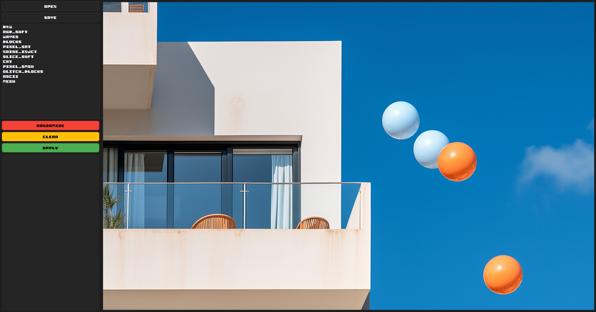
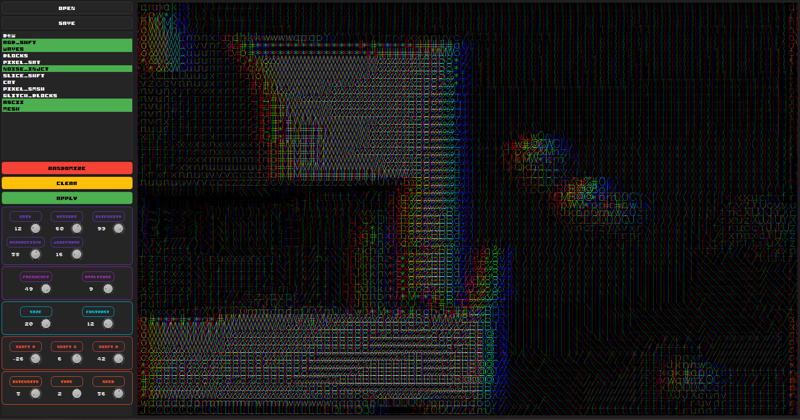
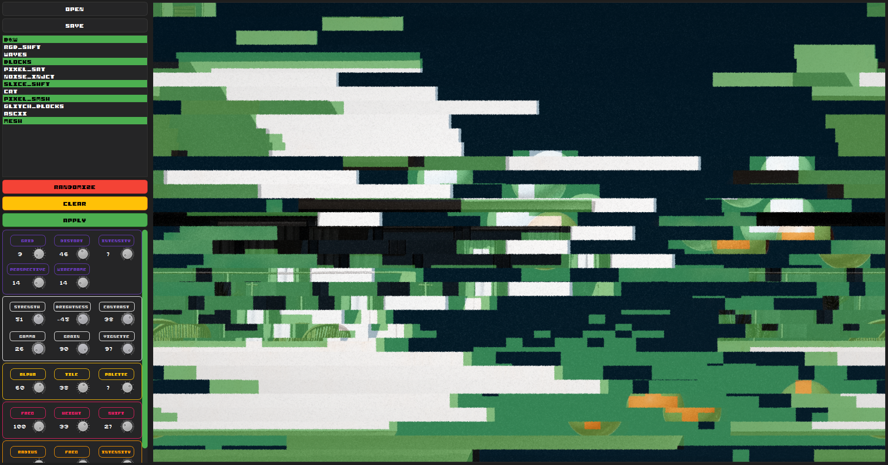
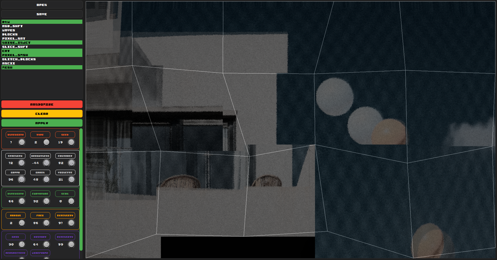

# Corrupto



An image editing application with a focus on glitch effects and digital distortion. Built with PySide6 and OpenCV, Corrupto provides a VST-like interface for applying various image effects in real-time.

## Features

- **Real-time Preview**: See effects applied instantly as you adjust parameters
- **Multiple Effects**: Multiple different glitch and distortion effects
- **Multi-selection**: Apply multiple effects simultaneously
- **Randomize**: Generate random effect combinations with one click
- **File Support**: Open and save PNG, JPEG, BMP, WebP, and TIFF formats

## Available Effects (as of 03Sep2025)

- **B&W**: Black & white conversion with brightness, contrast, gamma, grain, and vignette controls
- **RGB SHIFT**: Independent RGB channel shifting for chromatic aberration effects
- **WAVES**: Sine-wave horizontal distortion
- **BLOCKIFY**: Mosaic effect with customizable tile size and color palette
- **PIXEL SORT**: Sort pixels by brightness in rows or columns
- **NOISE INJECT**: Add gaussian, salt & pepper, or structured noise
- **SLICE SHIFT**: Cut image into strips and randomly shift them (VHS tracking errors)
- **CRT SCAN**: Simulate old CRT monitor scan lines and screen curvature
- **PIXEL SMASH**: Randomly displace pixels for digital distortion
- **GLITCH BLOCKS**: Replace random areas with corrupted data blocks
- **ASCII ART**: Convert image to ASCII characters
- **MESH**: 3D mesh distortion with perspective and wireframe effects

## Examples







## Installation

1. Clone or download this repository
2. Install the required dependencies:
   ```bash
   pip install -r requirements.txt
   ```
3. Run the application:
   ```bash
   python main.py
   ```

## Usage

1. **Open an Image**: Click "OPEN" to load a photo
2. **Select Effects**: Choose one or more effects from the list
3. **Adjust Parameters**: Use the knobs to fine-tune effect parameters
4. **Preview**: See real-time preview of your changes
5. **Apply**: Click "APPLY" to commit the effects to your image
6. **Save**: Use "SAVE" to export the image
7. **Randomize**: Click "RANDOMIZE" for instant random effect combinations

## Keyboard Shortcuts

- `Ctrl+O`: Open image
- `Ctrl+S`: Save image
- `Ctrl+Enter`: Apply current preview

## Controls

- **Knobs**: Drag to adjust parameters, right-click to reset to default
- **Text Input**: Click the number display to type exact values
- **Multi-selection**: Left click effects to select multiple

## Technical Details

- Built with PySide6 (Qt6) for the GUI
- OpenCV for image processing
- NumPy for numerical operations
- Real-time parameter adjustment with signal/slot architecture
- Vectorized operations for performance
- Support for Unicode file paths on Windows

## Requirements

- Python 3.8+
- PySide6
- OpenCV
- NumPy

See `requirements.txt` for exact version specifications.

## License

This project is open source.

## Contributing

Contributions are welcome! Feel free to:
**- Add new effects**
- Improve existing algorithms
- Enhance the UI
- Fix bugs

